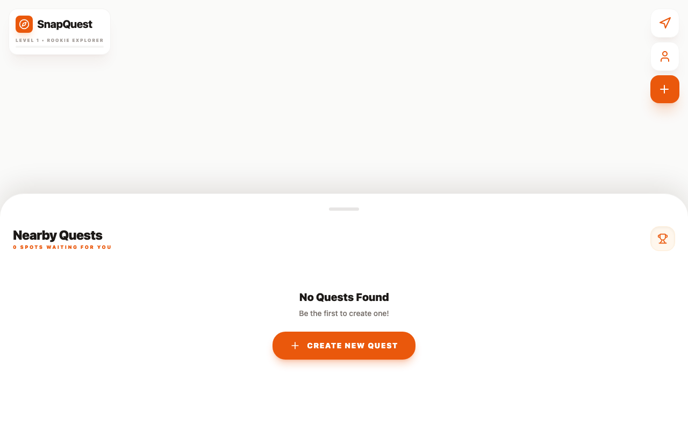

# 📸 SnapQuest

A photo-scavenger-hunt game: get an AI-generated quest, snap a matching photo, and score points on a map.


*Screenshot taken without a `GOOGLE_MAPS_API_KEY` configured, so the map area above "Nearby Quests" renders blank — this is a missing-config gap, not a bug.*

## Features

- 🎯 **AI quest generation** — quests generated via Google's Generative AI (Gemini)
- 📷 **Camera capture** — take a photo directly in-browser via `CameraInput` to complete a quest
- 🗺️ **Map & location** — quests and results plotted on a Google Map with marker clustering and live geolocation
- 🏆 **Scoring** — a `ScoreDisplay` component tracks points as quests are completed
- 💾 **Local persistence** — progress and settings kept in `localStorage` via VueUse

## Installation

```bash
git clone <this repo>
cd snapquest
pnpm install
```

## Usage

```bash
pnpm dev
```

Then open the printed local URL (dev server runs with `--host` for testing on other devices, e.g. a phone camera). Requires a Google Maps API key and a Generative AI API key set via Nuxt runtime config.

## Built with

- [Nuxt 4](https://nuxt.com/)
- [Vue 3](https://vuejs.org/)
- [Google Generative AI](https://ai.google.dev/)
- [vue3-google-map](https://github.com/diegoazh/vue3-google-map)
- [Tailwind CSS](https://tailwindcss.com/)

## Environment variables

Copy `.env.example` to `.env` and fill in the values before running the app:

- `GOOGLE_MAPS_API_KEY` — required to render the map; without it the map area renders blank (see screenshot note below).
- `GEMINI_API_KEY` — required for `/api/compare` to score a submitted quest photo against the target.

## Status

🚧 Actively developed prototype — core flow (create → camera match → map/result) is in place; UI layout and styling still being refined as of the latest commits.

⚠️ Runs, but requires your own Google Maps and Gemini API keys — verified `pnpm install && pnpm run build` succeeds without them as of 2026-09-03; the `/api/compare` route (Gemini-based image comparison) wasn't exercised against a live key.
